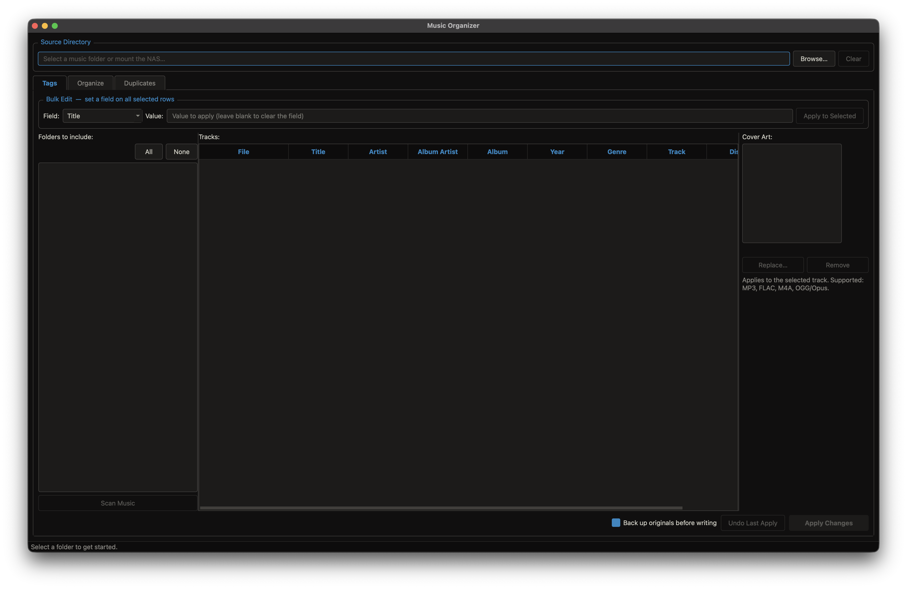
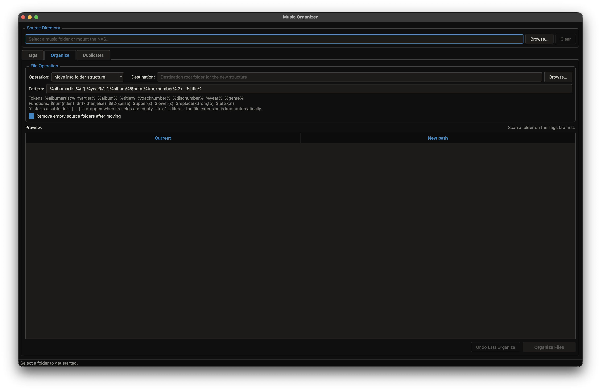

# Music Organizer

A desktop app for cleaning up a music library — edit tags in bulk, and
reorganize files into a tidy folder structure driven by those tags (foobar2000
File Operations style). Point it at a folder, review every track in an editable
table, and either write tag changes in place or move/rename files by a pattern.

Built with PyQt6 and [mutagen](https://mutagen.readthedocs.io/), themed with
[Flexoki](https://stephango.com/flexoki).

Main Window - Metadata Tags


Organize (file operations)


## Features

- **Editable table** — every tag field is editable inline (double-click a cell).
  Edited cells are highlighted so you can see exactly what will change before
  you commit.
- **Bulk edit** — select any number of tracks, pick a field (Album Artist,
  Album, Year, Genre, …), type one value, and apply it to all of them.
- **Edit these fields**: Title, Artist, Album Artist, Album, Year, Genre, Track
  number, Disc number, Comment.
- **Cover art** — view the embedded art for the selected track and replace it
  (JPEG/PNG) or remove it. Staged like tag edits and written on *Apply*.
  Supported for MP3, FLAC, M4A and OGG/Opus.
- **Validation** — bad values (non-numeric year/track) are flagged red and
  block *Apply Changes* until fixed.
- **In-place writes** — changes are written straight into the original files.
  Nothing is renamed or moved.
- **Backup before writing** — an on-by-default toggle copies every modified
  file into a timestamped `MusicOrganizer-Backups/` folder before touching it.
- **Undo last apply** — one click restores the previous tags and cover art on
  every file from the most recent apply (within the session).

### Organize tab — file operations

- **Move**, **Copy**, or **Rename in place** — build a clean library into a new
  folder structure (Move/Copy), or just rename files where they sit.
- **Pattern language** (foobar2000-style):
  - **Fields**: `%albumartist%`, `%artist%`, `%album%`, `%title%`,
    `%tracknumber%`, `%discnumber%`, `%year%`, `%genre%`.
  - **Optional sections**: `[ … ]` is dropped entirely when the fields inside
    it are empty — so an untagged file gets no stray `[Unknown Year]` folder.
  - **Literals**: text in `'single quotes'` is inserted verbatim (use `'['` for
    a literal bracket).
  - **Functions**: `$num(n,len)` (zero-pad), `$if(x,then,else)`, `$if2(x,else)`,
    `$upper(x)`, `$lower(x)`, `$replace(x,from,to)`, `$left(x,n)`.
  - A `/` starts a new subfolder; the file extension is preserved. Default
    pattern: `%albumartist%/['['%year%'] ']%album%/$num(%tracknumber%,2) - %title%`.
- **Live preview** of every current → new path, with **conflict detection**
  (two files targeting the same path, or an existing file in the way) that
  blocks the run until resolved.
- **Remove empty source folders** after moving.
- **Undo last organize** — moves files back (or deletes the copies).
- Organizing uses the *current* tag values shown in the table, so fixes you
  make on the Tags tab flow straight into the folder names.

### Duplicates tab — find & clean up

- **Detect duplicates** by tags (Artist + Title, optionally + Album) or by
  **identical file content** (byte-for-byte hash).
- Each group **auto-picks a keeper** (most complete tags, then largest file);
  select any row and **Keep Selected Instead** to override.
- **Quarantine** the non-keepers by moving them to a separate folder (not
  deleted) so you can review before removing. **Undo** moves them back.

### Throughout

- **Folder include/exclude** with a checkbox tree, including nested subfolders.
- **Stop scanning** mid-scan if you picked the wrong folder.
- **Per-row reset** — right-click a row to revert it to its original tags.
- **NAS / SMB mount support** *(Linux only)*.
- **Flexoki dark theme**.

## Supported formats

MP3, FLAC, M4A/AAC/ALAC, OGG/Opus, WMA.

## Run from source

```bash
pip install PyQt6 mutagen
python music_organizer.py      # Windows
python3 music_organizer.py     # macOS / Linux
```

## Build a standalone executable

```bash
python -m venv .venv
# Windows: .venv\Scripts\activate    macOS/Linux: source .venv/bin/activate
pip install pyinstaller PyQt6 mutagen
python build.py
```

Output lands in `dist/`:

| Platform | Output |
|----------|--------|
| Windows  | `dist\MusicOrganizer.exe` |
| macOS    | `dist/MusicOrganizer.app` |
| Linux    | `dist/music-organizer` |

PyInstaller can't cross-compile — build each platform on its own OS, or use the
GitHub Actions workflow in `.github/workflows/build.yml`, which builds all three
platforms on a `v*` tag and publishes a release.

## Install (from a release)

Grab the latest build from the [Releases](../../releases) page.

- **Windows** — download `MusicOrganizer.exe` and run it (SmartScreen: *More
  info → Run anyway*).
- **macOS** — download `MusicOrganizer-macos.zip`, double-click to unzip, then
  right-click `MusicOrganizer.app` → *Open* the first time (unsigned app).
- **Linux** — download `music-organizer-linux.tar.gz`, then:

  ```bash
  tar -xzf music-organizer-linux.tar.gz
  cd music-organizer-linux
  ./install.sh        # installs to ~/.local, adds an app-menu entry + icon
  ```

  "Music Organizer" then appears in your application menu with its icon.
  Run `./uninstall.sh` (or delete `~/.local/bin/music-organizer`, the
  `hicolor` icons, and `~/.local/share/applications/music-organizer.desktop`)
  to remove it.

## How to use

1. **Browse** to a music folder.
2. Untick any subfolders you don't want touched.
3. **Scan Music** — reads tags in the background.
4. Edit cells directly, or use **Bulk Edit** to set a field across selected
   rows. Edited cells light up; invalid values turn red.
5. Select a track to see its **cover art** on the right; *Replace…* or *Remove*
   to stage an art change.
6. Leave **Back up originals** ticked (recommended), then **Apply Changes** —
   confirm, and the new tags/art are written into the files.
7. Changed your mind? **Undo Last Apply** rolls the whole batch back.

> ⚠️ Writes modify your original files. Keep the backup toggle on (it copies
> originals to `MusicOrganizer-Backups/` before writing), and/or work on a copy of
> your library while experimenting.
